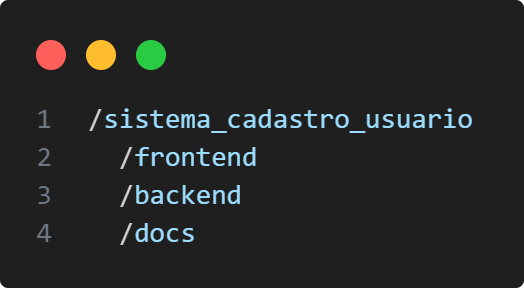
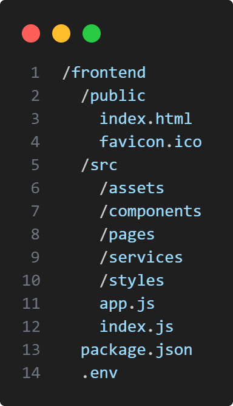
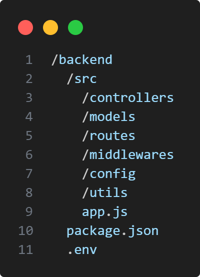
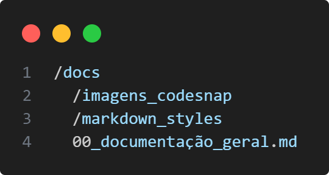
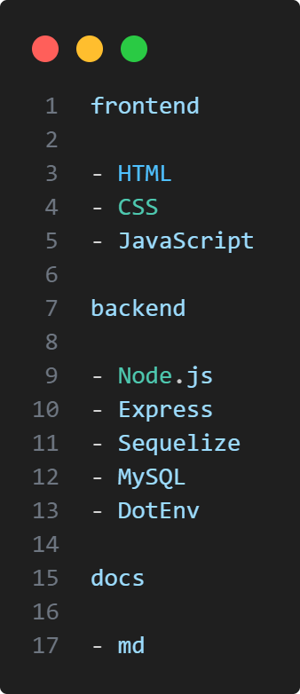

# Projeto

## Sistema Cadastro usuário

---

### - Descrição da estrutura geral do projeto -

#### 1. sistema_cadastro_usuario:

Master do projeto.

#### 2. frontend:

Branch onde será armazenado o frontend.

#### 3. backend:

Branch onde será armazenado o backend.

#### 4. docs:

Branch onde será armazenada toda a documentação.

---

### - Descrição da estrutura da pasta frontend -

#### 1. public:

Pasta onde será armazenado os seguintes itens:

- index.html: Página principal do HTML.
- flaticon.ico: Logo/Ícone da página HTML.

#### 2. src (source):

Pasta onde será armazenado um conjunto de pastas, cujo:

- assets: Contém imagens, fontes, arquivos estáticos.
- components: Contém componentes reutilizáveis (ex: botões, formulários).
- pages: Contém páginas da aplicação (ex: Home, Login, Signup).
- services: Contém as requisições a APIs (ex: login, cadastro).
- styles: Contém os arquivos CSS/SCSS ou preprocessadores.
- package.json: Contém as dependências e scripts do projeto frontend.

E também, os arquivos:

- app.js: Componente principal do aplicativo.
- index.js: Ponto de entrada da aplicação.
- .env: Variáveis de ambiente específicas do frontend (ex: URL da API).

---

### - Descrição da estrutura da pasta backend -

#### 1. src (source):

Pasta onde será armazenado um conjunto de pastas, cujo:

- controllers: Contém funções que manipulam as requisições.
- models: Contém modelos que representam as entidades no banco de dados.
- routes: Contém definições das rotas.
- middlewares: Contém funções que atuam como intermediárias.
- config: Contém configurações (ex: banco de dados).
- utils: Contém funções auxiliares.
- package.json: Contém as dependências e scripts do backend.

E também, os arquivos:

- app.js: Arquivo principal que inicia o servidor.
- .env: Variáveis de ambiente do backend.

---

### - Descrição da estrutura da pasta docs -

#### 1. docs (documentação):

pasta onde será armazenada toda documentação na formatação .md (markdown), cujo:

- imagens_codesnap: Contém as imagens usadas dentro dos documentos markdown.
- markdown_styles: Contém um arquivo .css que define o estilo do documento.

E também, os arquivos:

- 00_documentação_geral.md: Trata-se deste documento.
- 01_futuros_documentos...: Documentos futuros que irão aprofundar cada pasta do projeto.

---

### - Tecnologias e ferramentas à serem usadas -

---
